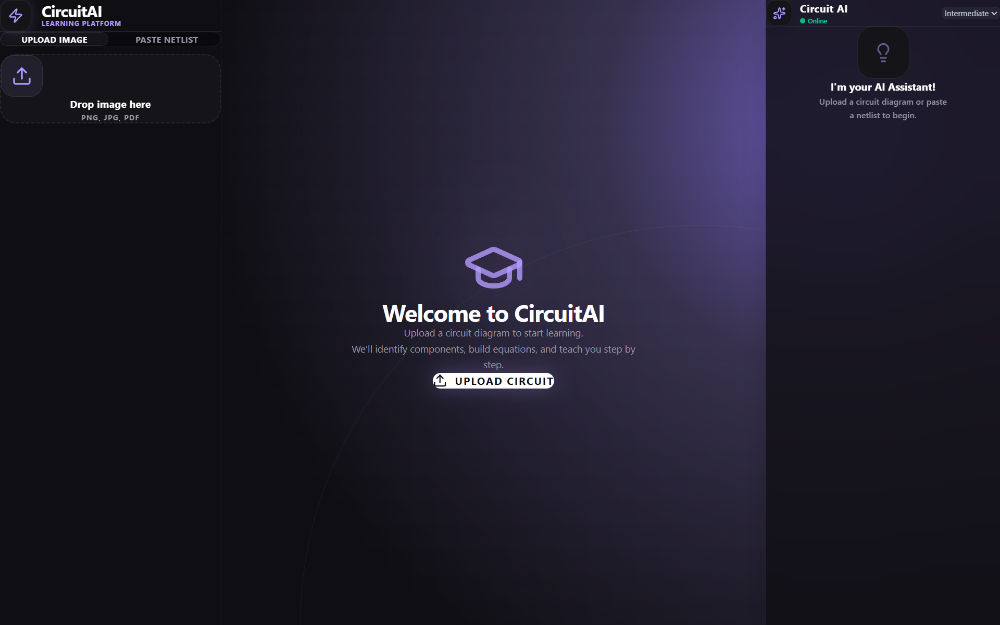
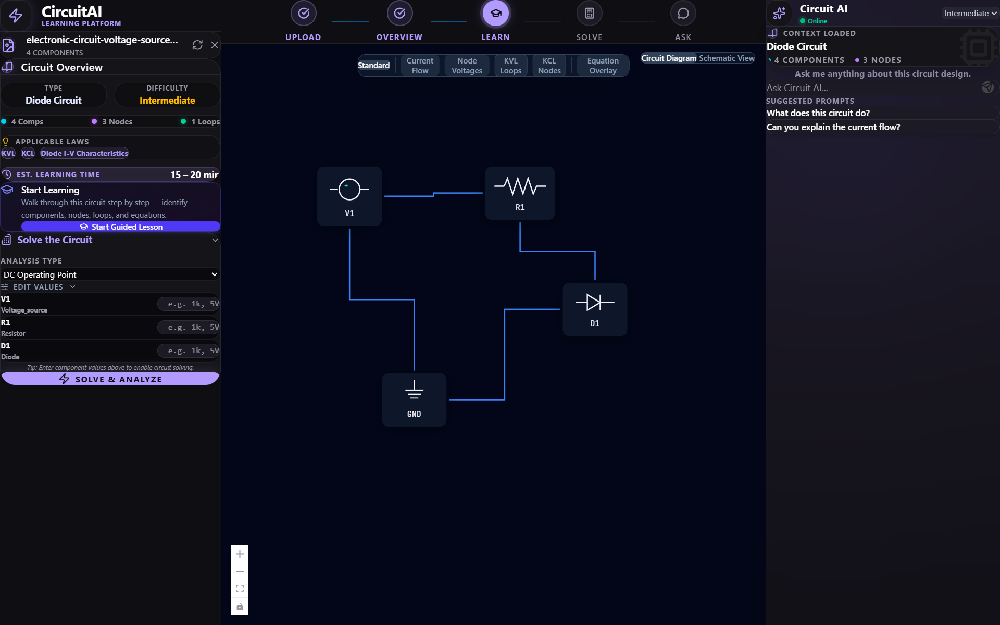
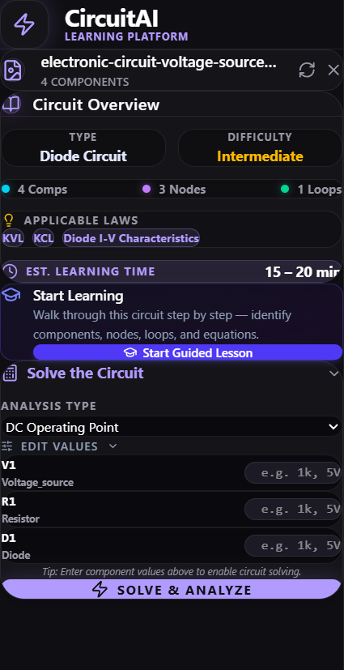
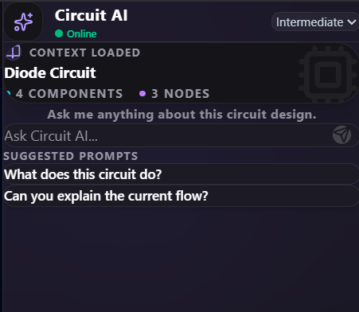
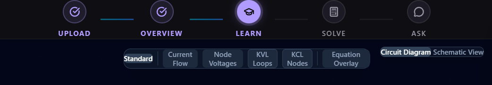

# Circuit AI Tutor ⚡

Circuit AI Tutor is an advanced, AI-powered educational platform designed for electrical engineering students. It allows users to upload hand-drawn or digital circuit diagrams, automatically detects components, extracts the netlist, and provides interactive, pedagogical tutoring. 

By leveraging the cutting-edge **Gemini 2.5 Flash** Vision-Language Model, Circuit AI effortlessly bridges the gap between rough sketches and SPICE-level simulation.



---

## ✨ Features

- **Automated Circuit Recognition**: Upload an image of a circuit, and the Gemini VLM pipeline accurately identifies components, values, and wiring topologies.
- **Auto-Repair Engine**: Intelligently fixes floating nodes, missing grounds, and unconnected pins to ensure the extracted netlist is simulation-ready.
- **Interactive SPICE Simulation**: Powered by `PySpice`/`Ngspice`, allowing students to simulate DC, AC, and Transient behaviors instantly.
- **Agentic AI Tutor**: A personalized, context-aware chatbot that explains circuit behavior, relevant physics laws (e.g., KVL, KCL), and helps debug issues.
- **Bento-box UI**: A highly polished, modern React interface featuring glassmorphism, dynamic glowing borders, and a beautiful node-based graph editor powered by `React Flow`.

---

## 🛠️ Tech Stack

### Frontend
- **Framework**: React 18 + TypeScript + Vite
- **Styling**: Tailwind CSS (with custom modern UI tokens)
- **Circuit Visualization**: React Flow
- **Icons**: Lucide React

### Backend
- **Framework**: FastAPI (Python 3.14)
- **AI / VLM Engine**: Google GenAI (`gemini-2.5-flash`) for vision detection and tutoring.
- **Simulation**: PySpice + Ngspice

---

## 🚀 Getting Started

### Prerequisites
- Node.js (v18+)
- Python (v3.10+)
- Ngspice (must be installed and available in system PATH)

### 1. Backend Setup

1. Navigate to the backend directory:
   ```bash
   cd backend
   ```
2. Create and activate a virtual environment:
   ```bash
   python -m venv venv
   # On Windows:
   .\venv\Scripts\activate
   # On macOS/Linux:
   source venv/bin/activate
   ```
3. Install dependencies:
   ```bash
   pip install -r requirements.txt
   ```
4. Set up your environment variables by creating a `.env` file in the `backend/` directory:
   ```env
   GEMINI_API_KEY=your_gemini_api_key_here
   ```
5. Start the FastAPI server:
   ```bash
   uvicorn main:app --host 0.0.0.0 --port 8001 --reload
   ```

### 2. Frontend Setup

1. Open a new terminal and navigate to the frontend directory:
   ```bash
   cd frontend
   ```
2. Install dependencies:
   ```bash
   npm install
   ```
3. Start the Vite development server:
   ```bash
   npm run dev
   ```
4. Open your browser to `http://localhost:5173`.

---

## 📸 Gallery


*Complete view of the Circuit AI Dashboard.*


*Interactive graph editor and simulation controls.*


*Real-time component properties and AI Tutor side-panel.*


*VLM pipeline progress, component counter, and simulation status.*

---

## 🤝 Contributing
Contributions, issues, and feature requests are welcome! Feel free to check the issues page.

## 📝 License
This project is licensed under the MIT License.
